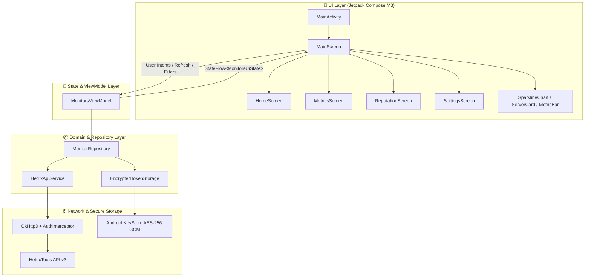

<div align="center">

# HetriX

**Modern, open-source Android monitoring client for [HetrixTools](https://hetrixtools.com).**

[](https://www.gnu.org/licenses/gpl-3.0)
[-3DDC84.svg?style=flat-square&logo=android&logoColor=white)](https://developer.android.com)
[](https://kotlinlang.org)
[](https://developer.android.com/jetpack/compose)
[](https://developer.android.com/topic/architecture)

</div>

---

## 🚀 Overview

**HetriX** is an open-source, production-grade Android application engineered for DevOps engineers, sysadmins, and webmasters who rely on **HetrixTools** for server telemetry, uptime monitoring, and reputation alerting. 

Engineered with Kotlin and Jetpack Compose Material 3 according to modern Android Design Guidelines and the 60-30-10 visual balance rule, HetriX provides a local-first, zero-telemetry client that connects directly to the HetrixTools v3 API with hardware-backed encryption.

---

## ✨ 4-Destination Workspace Architecture

HetriX is organized into four persistent primary destinations with an edge-to-edge Material 3 layout:

### 1. 🏠 Home — Unified Dashboard & Uptime
- **Global Health Card**: At-a-glance fleet status with operational and incident variations (e.g. `✓ All Systems Operational` vs `! 2 Outages Detected`).
- **24-Hour Availability Blocks**: Micro-block visual history (`▰ ▰ ▰`) paired with exact percentages (e.g., `99.98%`).
- **Real-Time Telemetry**: Real-time response times (ms), last checked timestamps, target URLs/IPs, and check intervals.
- **Global Location Checks**: Expandable multi-point geographic checks (Dallas, Frankfurt, London, Singapore, Sydney, etc.) with individual status and latency.
- **Search & Filter**: Search by monitor name or target IP/host, with instant filters for All, Down, and Operational.

### 2. 🖥️ Servers — Cross-Fleet Resource Telemetry
- **Fleet Aggregate Status**: Fleet-wide average utilization meters for CPU, RAM, and Disk capacity.
- **Per-Server Metrics Cards**:
  - **CPU Utilization**: Live gauge + smooth canvas-rendered historical sparkline chart.
  - **RAM & Disk Breakdown**: Tabular byte gauges displaying exact used vs. total values (e.g., `5.8 / 16.0 GB`).
  - **Swap Memory**: Expandable auxiliary memory inspection.
  - **System Vitals**: Load Average (1m / 5m / 15m), OS kernel version, running system uptime, and active open ports.
  - **Network I/O Throughput**: Live directional throughput rates (`↓ in • ↑ out`).

### 3. 🛡️ Reputation — Blacklist & Microsoft SNDS
- **Reputation Health Banner**: Instant overview of clean IPs vs active listings across global RBLs and Microsoft SNDS.
- **Priority Incident Sorting**: Automatically prioritizes listed and degraded IPs at the top (`Listed` → `Warning` → `Unknown` → `Clean`).
- **Listed Ratio Badges**: Clear `0/32 Listed` or `2/32 Listed` badges with direct links to HetrixTools delisting guides.
- **Microsoft SNDS Status**: Explicit status indicators (`Clean`, `Warning`, or `Not available`).

### 4. ⚙️ Settings & API Vault
- **API Vault Card**: Secure local KeyStore AES-256 GCM encrypted token storage with masked preview.
- **Live Connection Diagnostics**: "Test Connection" tool showing exact ping latency in milliseconds.
- **Key Management**: Replace API Key modal with clipboard paste support and secure input masking.
- **Appearance & Preferences**: Switch between System Default, Dark Slate (`#0B0F19`), and Crisp Light (`#FFFFFF`).
- **Auto-Refresh Scheduling**: Configurable polling intervals (Manual, 30s, 1m, 2m, 5m).
- **Privacy & Storage**: Clear cached telemetry data and Disconnect actions.

---

## 🎨 Visual System & 60-30-10 Palette

HetriX adheres to a strict 60–30–10 visual hierarchy:

| Role | Dark Mode | Light Mode |
|---|---|---|
| **60% Background** | Deep Slate `#0B0F19` | Crisp White `#F8FAFC` |
| **30% Surfaces & Cards** | Navy-Gray `#1E2638` | Pale Neutral `#FFFFFF` |
| **10% Operational Accent** | Emerald Green `#10B981` | Emerald Green `#059669` |
| **10% Degraded / Warning** | Amber `#F59E0B` | Amber `#D97706` |
| **10% Down / Blacklisted** | Crimson `#EF4444` | Crimson `#DC2626` |
| **Neutral / Inactive** | Slate `#64748B` | Slate `#94A3B8` |

- **Typography**: Roboto with tabular lining numerals for consistent metric scanning.
- **Accessibility**: Minimum 48dp touch targets, TalkBack semantics, high-contrast labels, and font scaling support.

---

## 🏗️ Architecture



---

## 📡 HetrixTools v3 API Integration

HetriX connects directly to the official HetrixTools REST API v3:
- **Base URL**: `https://api.hetrixtools.com/v3/`
- **Authentication**: `Authorization: Bearer <API_TOKEN>`

### Endpoints:
1. `GET /v3/ping` — Validates API token and measures latency (`status: "ok", message: "pong"`).
2. `GET /v3/uptime-monitors` — Retrieves uptime monitors, target hostnames, response times, and location checks.
3. `GET /v3/uptime-monitors/{id}/server-agent/metrics` — Retrieves CPU, memory breakdown, disk usage, load averages, open ports, and network interfaces.
4. `GET /v3/blacklist-monitors` — Retrieves blacklist monitors, detected RBL listings, and Microsoft SNDS statuses.

---

## 🛠️ Getting Started & Build Instructions

### Prerequisites
- Android Studio Meerkat (2024.3+) or Ladybug (2024.2+)
- JDK 17 or JDK 21
- Android SDK (API 35 compile target, min SDK API 26)

### Building the Project
```bash
# Clone the repository
git clone https://github.com/etahamad/hetrix-android.git
cd hetrix-android

# Build Debug APK
./gradlew assembleDebug

# Run Unit Tests
./gradlew testDebugUnitTest
```

---

## 📁 Project Structure

```
hetrix-android/
├── app/
│   ├── build.gradle.kts
│   ├── proguard-rules.pro
│   └── src/
│       ├── main/
│       │   ├── AndroidManifest.xml
│       │   ├── java/io/github/etahamad/hetrix/
│       │   │   ├── HetrixApplication.kt
│       │   │   ├── MainActivity.kt
│       │   │   ├── data/
│       │   │   │   ├── api/                   # Retrofit service, interceptors, error mapping
│       │   │   │   ├── local/                 # EncryptedSharedPreferences (AES-256 GCM)
│       │   │   │   ├── model/                 # Kotlinx Serialization DTOs & Domain mappers
│       │   │   │   └── repository/            # MonitorRepository & cache management
│       │   │   └── ui/
│       │   │       ├── components/            # SparklineChart, ServerCard, MetricBar, StatusBadge
│       │   │       ├── home/                  # HomeScreen (Global Health, Uptime, Micro-blocks)
│       │   │       ├── metrics/               # MetricsScreen (Cross-fleet telemetry, Sparklines)
│       │   │       ├── reputation/            # ReputationScreen (RBL Blacklists, SNDS)
│       │   │       ├── settings/              # SettingsScreen (API Vault, Diagnostics, Theming)
│       │   │       ├── main/                  # MainScreen (4-tab Navigation, ViewModel, State)
│       │   │       ├── theme/                 # 60-30-10 Palette, Typography, Shapes
│       │   │       └── util/                  # Byte formatting, time utils, ViewModelFactory
│       │   └── res/                           # Vector icons, app icons, strings
│       └── test/                              # Repository & ViewModel unit test suites
├── gradle/
│   └── libs.versions.toml                     # Version catalog
├── LICENSE                                    # GNU General Public License v3.0
└── README.md                                  # Documentation
```

---

## 📄 License

Distributed under the **GNU General Public License v3.0 (GPLv3)**. See [`LICENSE`](LICENSE) for details.

```
HetriX  Copyright (C) 2026 Omar Hamad (etahamad)
This program comes with ABSOLUTELY NO WARRANTY.
This is free software, and you are welcome to redistribute it
under certain conditions; see the LICENSE file for details.
```
