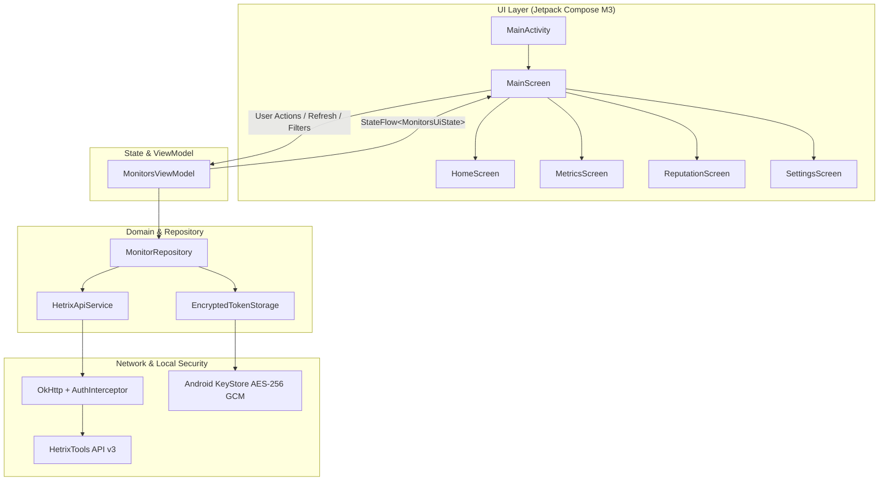

<div align="center">

# HetriX

**Unofficial Android client for [HetrixTools](https://hetrixtools.com).**

[](https://www.gnu.org/licenses/gpl-3.0)
[-3DDC84.svg?style=flat-square&logo=android&logoColor=white)](https://developer.android.com)
[](https://kotlinlang.org)
[](https://developer.android.com/jetpack/compose)

</div>

---

## Overview

HetriX is an open-source, unofficial Android client for the [HetrixTools](https://hetrixtools.com) monitoring service. It connects directly to the official HetrixTools REST API v3 to display uptime status, server resource metrics, and blacklist reputation on Android devices.

The app operates strictly client-side without any third-party backend, tracking, or telemetry. API keys are stored locally on the device using Android's EncryptedSharedPreferences backed by the Android Keystore (AES-256 GCM).

---

## Features

### 1. Home (Uptime Monitoring)
- Overall infrastructure health overview with incident badges.
- 24-hour availability history blocks and availability percentages.
- Response times, check intervals, and last-checked timestamps.
- Multi-location check results (e.g., Dallas, Frankfurt, London, Singapore, Sydney, Tokyo).
- Search and filtering by status (All, Down, Operational).

### 2. Servers (Resource Metrics)
- Fleet-wide average utilization metrics for CPU, RAM, and disk storage.
- Detailed metrics per server:
  - CPU usage percentage and historical sparkline trend graph.
  - RAM and disk space breakdown (used vs total).
  - Swap space usage and system load averages (1m, 5m, 15m).
  - Operating system release, kernel, and system uptime.
  - Live inbound and outbound network throughput rates.

### 3. Reputation (Blacklist & SNDS)
- Blacklist monitor summary across configured IPv4/IPv6 addresses and hostnames.
- Immediate sorting for listed and degraded hosts.
- Listing counts per host with links to HetrixTools delisting guides.
- Microsoft SNDS status reporting.

### 4. Settings
- API key management with local validation and secure masked storage.
- Built-in connection testing tool with latency measurement.
- Theme selection (System Default, Dark, Light).
- Configurable foreground auto-refresh interval (Manual, 30s, 1m, 5m).
- Local cache clearance and account disconnect options.

---

## Architecture

The project follows the standard Android Architecture Guidelines using MVVM and Unidirectional Data Flow (UDF):



### Tech Stack
- **Language**: Kotlin 2.0.21
- **UI Toolkit**: Jetpack Compose with Material 3
- **Asynchronous**: Kotlin Coroutines & StateFlow
- **Networking**: Retrofit 2 & OkHttp 3
- **Serialization**: Kotlinx Serialization JSON
- **Security**: AndroidX Security Crypto (`EncryptedSharedPreferences`)
- **Minimum SDK**: Android 8.0 (API Level 26)
- **Target SDK**: Android 15 (API Level 35)

---

## API Integration

HetriX communicates directly with the HetrixTools v3 REST API:

- **Base URL**: `https://api.hetrixtools.com/v3/`
- **Authentication**: `Authorization: Bearer <API_TOKEN>`

### Endpoints Used
- `GET /v3/ping` — Validates credentials and measures roundtrip latency.
- `GET /v3/uptime-monitors` — Fetches uptime monitors, target hosts, and multi-location checks.
- `GET /v3/uptime-monitors/{id}/server-agent/metrics` — Fetches CPU, memory, disk, load averages, and network interfaces.
- `GET /v3/blacklist-monitors` — Fetches blacklist check results and Microsoft SNDS statuses.

---

## Build Instructions

### Requirements
- Android Studio Ladybug (2024.2+) or newer
- JDK 17
- Android SDK with API Level 35

### Building from Source

```bash
# Clone the repository
git clone https://github.com/etahamad/hetrix-android.git
cd hetrix-android

# Build Debug APK
./gradlew assembleDebug

# Build Release APK
./gradlew assembleRelease

# Run Unit Tests
./gradlew testDebugUnitTest
```

The compiled APKs will be located at:
- Debug: `app/build/outputs/apk/debug/app-debug.apk`
- Release: `app/build/outputs/apk/release/app-release.apk`

---

## Disclaimer

This is an unofficial, community-developed open-source client. It is not affiliated with, maintained, authorized, or endorsed by HetrixTools or any of its affiliates. All product names, logos, and brands are property of their respective owners.

---

## License

This project is licensed under the **GNU General Public License v3.0 (GPLv3)**. See the [LICENSE](LICENSE) file for details.
