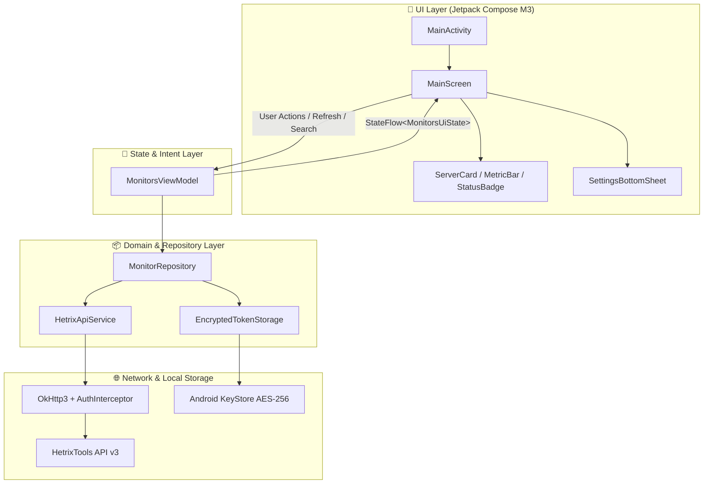

<div align="center">

# HetriX

**Modern, open-source Android monitoring client for [HetrixTools](https://hetrixtools.com).**

[](https://www.gnu.org/licenses/gpl-3.0)
[-3DDC84.svg?style=flat-square&logo=android&logoColor=white)](https://developer.android.com)
[](https://kotlinlang.org)
[](https://developer.android.com/jetpack/compose)
[](https://developer.android.com/topic/architecture)

</div>

---

## 🚀 Overview

**HetriX** is an open-source, production-grade Android application engineered for DevOps engineers, sysadmins, and webmasters who rely on **HetrixTools** for server monitoring and uptime alerting. 

Built with Kotlin and Jetpack Compose Material Design 3, HetriX provides an edge-to-edge mobile experience to monitor servers, uptime heartbeats, ping latency, and server telemetry (CPU, RAM, Swap, and Disk utilization).

---

## ✨ Key Features

- 🛰️ **Real-Time Uptime & Heartbeat Monitoring**: Track online/offline status, response times, and uptime ratios across all your HetrixTools monitors.
- 📊 **Server Agent Telemetry**: Visualize live CPU usage, RAM allocation, Swap memory, and Disk usage via animated progress bars with dynamic color thresholds.
- 🎨 **Material Design 3 & Dynamic Theming**: Full support for Android 12+ wallpaper dynamic coloring (`dynamicDarkColorScheme` / `dynamicLightColorScheme`), tonal surface elevation, and custom status styling.
- 🔒 **Hardware-Backed Encryption**: API Bearer tokens are persisted securely using AndroidX Security Crypto (`EncryptedSharedPreferences`) backed by AES-256 GCM MasterKeys.
- ⚡ **Pull-to-Refresh & Foreground Sync**: Instant synchronization via official Compose M3 `PullToRefreshBox` with smooth refresh animations.
- 🔍 **Instant Search & Multi-criteria Filtering**: Search by server name, hostname, or IP; filter by Online, Offline, or Agent servers; sort by status, CPU load, latency, or uptime.
- 🛡️ **Robust Error Handling**: Type-safe network exceptions, friendly banners for HTTP 401/403/429/500 errors, timeout handling, and one-tap retry actions.
- 📱 **True Edge-to-Edge Experience**: Automatic window insets handling for status and navigation bars across modern Android versions.

---

## 🏗️ Architecture & Technology Stack

HetriX adheres to Google's official Android Architecture Guidelines, enforcing **Unidirectional Data Flow (UDF)** and clean separation of concerns.



### Component Breakdown:
| Layer | Technologies | Responsibility |
|---|---|---|
| **UI** | Jetpack Compose, Material 3, Compose BOM | Renders reactive state, handles edge-to-edge window insets, smooth animations. |
| **ViewModel** | `androidx.lifecycle:lifecycle-viewmodel-compose`, Kotlin Coroutines | Holds immutable `StateFlow`, coordinates search/sorting, executes background sync. |
| **Repository** | Kotlin Coroutines `Flow`, Kotlinx Serialization | Manages data retrieval, concurrent telemetry enrichment, and error mapping. |
| **Network** | Retrofit 2, OkHttp 3, Logging Interceptor | Connects to `https://api.hetrixtools.com/v3/` with custom `AuthInterceptor` and 10s timeouts. |
| **Security** | `androidx.security:security-crypto` | Safely stores user API Bearer tokens with AES-256 encryption. |

---

## 📡 HetrixTools v3 API Integration

HetriX communicates with the official HetrixTools REST API v3:
- **Base URL**: `https://api.hetrixtools.com/v3/`
- **Authentication**: `Authorization: Bearer <API_TOKEN>`

### Connected Endpoints:
1. `GET uptime/monitors` — Retrieves list of uptime/heartbeat monitors, labels, URLs/IPs, status, and uptime percentages.
2. `GET uptime/monitors/{monitor_id}/server-agent-metrics` — Retrieves real-time telemetry metrics (CPU %, RAM %, Swap %, Disk %, Load Average).

---

## 🛠️ Getting Started & Build Instructions

### Prerequisites
- Android Studio Ladybug / Meerkat or newer (or IntelliJ IDEA with Android plugin)
- JDK 17 or JDK 21
- Android SDK (API 35 compile target, API 26+ device or emulator)

### Cloning & Building
```bash
# Clone the repository
git clone https://github.com/etahamad/hetrix-android.git
cd hetrix-android

# Build debug APK
./gradlew assembleDebug

# Run unit test suite
./gradlew test
```

### Generating Release APK / Bundle
```bash
./gradlew assembleRelease
# or for Google Play App Bundle
./gradlew bundleRelease
```

---

## 🔑 HetrixTools API Setup

1. Log into your [HetrixTools Dashboard](https://hetrixtools.com).
2. Navigate to **Account Settings** → **API**.
3. Copy your **v3 API Bearer Token**.
4. Open **HetriX** on your Android device, tap **Configure API Token** (or the Settings icon in the top app bar), paste your token, and tap **Save & Connect**.

---

## 📁 Project Structure

```
hetrix-android/
├── app/
│   ├── build.gradle.kts
│   ├── proguard-rules.pro
│   └── src/
│       ├── main/
│       │   ├── AndroidManifest.xml
│       │   ├── java/io/github/etahamad/hetrix/
│       │   │   ├── HetrixApplication.kt           # App lifecycle & service locator
│       │   │   ├── MainActivity.kt                # Compose entry point & edge-to-edge
│       │   │   ├── data/
│       │   │   │   ├── api/                       # Retrofit service, interceptors, error mapping
│       │   │   │   ├── local/                     # EncryptedSharedPreferences token storage
│       │   │   │   ├── model/                     # Kotlinx Serialization DTOs & Domain entities
│       │   │   │   └── repository/                # Repository interface & implementation
│       │   │   └── ui/
│       │   │       ├── components/                # ServerCard, MetricBar, StatusBadge, ErrorBanner
│       │   │       ├── main/                      # MainScreen, MonitorsViewModel, MonitorsUiState
│       │   │       ├── settings/                  # SettingsBottomSheet with token validator
│       │   │       ├── theme/                     # Material 3 Color, Type, Shape, Theme
│       │   │       └── util/                      # Time formatting and ViewModel factories
│       │   └── res/                               # Vector assets, themes, and string definitions
│       └── test/                                  # Repository & ViewModel unit tests
├── gradle/
│   └── libs.versions.toml                         # Gradle Version Catalog
├── build.gradle.kts                               # Root build script
├── settings.gradle.kts                            # Settings & module declaration
├── LICENSE                                        # GNU General Public License v3.0
└── README.md                                      # Documentation
```

---

## 🤝 Contributing

Contributions, bug reports, and feature suggestions are welcome!

1. Fork the Project: `https://github.com/etahamad/hetrix-android`
2. Create your Feature Branch: `git checkout -b feature/AmazingFeature`
3. Commit your Changes: `git commit -m 'Add some AmazingFeature'`
4. Push to the Branch: `git push origin feature/AmazingFeature`
5. Open a Pull Request targeting the `main` branch.

Please ensure all tests pass (`./gradlew test`) before submitting a PR.

---

## 📄 License

Distributed under the **GNU General Public License v3.0 (GPLv3)**. See [`LICENSE`](LICENSE) for the full license text.

```
HetriX  Copyright (C) 2026 Omar Hamad (etahamad)
This program comes with ABSOLUTELY NO WARRANTY.
This is free software, and you are welcome to redistribute it
under certain conditions; see the LICENSE file for details.
```
